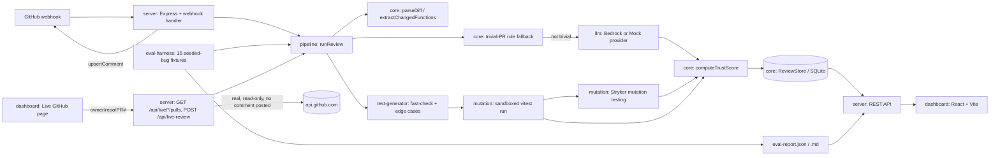

# AI Code Review Verifier

A GitHub App that reviews pull requests — especially AI-generated ones — by combining an
LLM risk/intent summary, generated property-based and edge-case tests, real mutation
testing (Stryker) to check those tests actually constrain the code, and a **trust score
with evidence**. The centerpiece is an evaluation harness: 15 fixtures seeded with known
bug categories, used to measure precision/recall of the bot's own findings against a
no-AI (rules-only) baseline.

It runs three ways:

- **GitHub Action**: two workflows that keep untrusted PR code and secrets in separate
  jobs. This is the fastest way to use it on real repos; see [Running it for real](#running-it-for-real).
- **Hosted GitHub App**: Postgres-backed queue, workers that review a real checkout in
  locked-down sandbox containers, Check Runs, and a dashboard behind "Sign in with
  GitHub" (`docker compose up`, see [`infra/README.md`](infra/README.md)).
- **Local demo**: the dashboard, fixtures and the Live GitHub page, no credentials needed.

The dashboard itself is a dark terminal/HUD-styled UI (black background, neon cyan/
magenta accents, a circular "trust gauge," a scan animation while a live review runs) —
see the screenshots-by-description in [Dashboard](#dashboard).

## Headline result

Run with the deterministic mock LLM provider (no AWS credentials needed):

| Metric | Full pipeline | No-AI baseline (line-diff rules only) |
| --- | --- | --- |
| Precision | 100.0% | 100.0% |
| Recall | 100.0% | 69.2% |
| F1 | 1.000 | 0.818 |
| Seeded bugs detected | 13 / 13 | 9 / 13 |
| False positives | 0 | 0 |

Reproduce it yourself: `npm run eval` (see [Evaluation harness](#evaluation-harness)).
The gap between the two columns is the whole point of the project: it's the measured
value of LLM + whole-function reasoning over what a plain regex-based linter already
catches — with a real, currently-honest limitation documented in
[Known limitations](#known-limitations) rather than papered over.

**Those numbers are on hand-seeded fixtures, and they overstate real-world performance.**
On 35 *real* bugs, mined from four `unjs/*` repos by reverting small behavior-fixing
commits (`npm run mine`), the same pipeline with the **mock** provider catches 7/35
(20% recall), versus 6/35 (17%) for rules only. That's the honest baseline a real model
has to beat. The harness can now measure it
(`LLM_PROVIDER=anthropic npm run eval -- --fixtures <mined dir> --max-cost 5`), but no
real-model run has happened yet, because no API key was available while this was built.

## Architecture



## Dashboard

A dark, terminal/HUD-styled React app — four pages:

- **Reviews** — the review log (a leaderboard-style table): repo, PR, trust score badge,
  finding count, latency, cost, timestamp. Live-fetched reviews are tagged with a
  pulsing `LIVE` badge.
- **Live GitHub** — type any public `owner/name`, click **Scan repo** to list its real
  open PRs (or type a PR number directly, including merged/closed ones), click
  **Analyze**, watch a scan animation, land on a full trust-score page for a *real* PR.
- **Review detail** — a circular trust-score gauge (color-coded: green/amber/red), the
  score breakdown by signal (LLM risk, mutation-verified coverage, test health, rule
  checks), every finding with severity and evidence, generated-test results, and
  mutation-testing results — plus a "View on GitHub ↗" link back to the real PR when
  applicable.
- **Eval report** — the seeded-bug benchmark's precision/recall/F1, full pipeline vs.
  no-AI baseline, as a bar chart, plus a per-fixture table linking into real review pages.
- **Try it** — pick a seeded-bug fixture or paste a diff and run the pipeline against it
  without needing a real repo.

### Packages

| Package | Responsibility |
| --- | --- |
| `@acrv/core` | Shared types, unified-diff parsing, AST-based changed-function extraction (ts-morph), deterministic rule-based static analysis (also the no-AI baseline), trust-score computation, and a `ReviewStore` interface with a SQLite implementation (stands in for DynamoDB — same `put`/`get`/`listByRepo` shape). |
| `@acrv/llm` | `LLMProvider` interface. `ClaudeProvider` calls Claude (default `claude-opus-5`) via the Anthropic API (with server-side refusal fallbacks) or Amazon Bedrock (Mantle client, `anthropic.claude-opus-5`). It uses schema-enforced structured output, fences PR content as untrusted data (and flags injection attempts), grounds findings against the real diff, and splits large PRs into chunks instead of truncating them. `MockProvider` is a deterministic heuristic stand-in for local use. |
| `@acrv/test-generator` | Generates edge-case unit tests and a fast-check property-based test per exported changed function, from its parameter/return types. No correctness oracle is assumed (see limitations) — it asserts type/no-throw invariants so mutation testing has something to run against. |
| `@acrv/mutation` | Sandbox executors: `DockerExecutor` (no network, read-only, no capabilities, resource limits, non-root, optional gVisor) and a scrubbed-environment `LocalProcessExecutor` for trusted code. Also the project runner: detects npm/pnpm/yarn and vitest/jest/mocha, installs with lifecycle scripts off and then runs them offline, and runs **Stryker on only the changed lines against the project's own test suite**. |
| `@acrv/pipeline` | `runReview()` (diff-only mode: fixtures, pasted diffs, Live GitHub) and `runWorkspaceReview()` / `executeWorkspace()` (real-checkout mode: git diff from objects, generated tests next to the real sources, own-test mutation). Untrusted PR code only runs under an executor that allows it. |
| `@acrv/server` | Webhook receiver (HMAC plus delivery-id dedupe), a Postgres job queue (`SKIP LOCKED`, supersede, retry, dead-letter, heartbeat recovery), workers, GitHub App auth (repo-scoped least-privilege installation tokens), Check Runs, GitHub OAuth sign-in with per-repo access control, CSRF checks, rate limits, per-account LLM budgets, JSON logs and `/metrics`. |
| `@acrv/action` | The GitHub Action (`action.yml`): `execute` / `report` / `all` modes, annotations, job summary, PR comment, and a `fail-below` gate. |
| `@acrv/eval-harness` | 15 fixtures under `fixtures/`, each a before/after file pair plus a `meta.json` of seeded bugs; `runBenchmark()` runs the real pipeline against each and computes precision/recall/F1 for the full pipeline and for a rules-only baseline. |
| `@acrv/dashboard` | React + Vite UI (dark terminal/HUD theme): review history, a **Live GitHub** page that fetches and analyzes real public PRs, a review detail page (trust gauge, evidence, generated tests, mutation results), the evaluation report (precision/recall/F1 comparison chart), and a "Try it" page for seeded examples or a pasted diff. |

## Quickstart

```bash
npm install

# Run everything (unit + real Stryker mutation-testing integration tests)
npm test

# Run the evaluation harness and print/report precision, recall, F1
npm run eval

# Start the backend (defaults to LLM_PROVIDER=mock, no AWS needed)
npm run dev:server     # http://localhost:3001

# In another terminal, start the dashboard
npm run dev:dashboard  # http://localhost:5173
```

Open the dashboard at `http://localhost:5173` and go to **Live GitHub** — type a real
public repo (e.g. `sindresorhus/ky`), click **Scan repo** to list its real open PRs (or
type any PR number directly), click **Analyze**, and watch the full pipeline run against
an actual PR diff fetched from GitHub right now. No token, GitHub App, or AWS account
needed — it works unauthenticated against public repos (at GitHub's lower unauthenticated
rate limit; set `GITHUB_TOKEN` on the server for a much higher limit). It never posts
anything back to the real repo — see [What's real vs. stubbed](#whats-real-vs-stubbed).

Prefer a guaranteed-reproducible example over a live repo (which changes over time)?
Go to **Try it** instead, pick any seeded-bug fixture from the dropdown, and click
**Run review** — same pipeline, against a fixture with a known, documented bug.

### Using a real model instead of the mock provider

```bash
export LLM_PROVIDER=anthropic ANTHROPIC_API_KEY=...        # Anthropic API, claude-opus-5 by default
# or
export LLM_PROVIDER=bedrock AWS_REGION=us-east-1           # Bedrock, anthropic.claude-opus-5 by default
export ACRV_MODEL_ID=...                                   # optional model override
npm run dev:server
```

### Raising the GitHub rate limit / enabling real PR comments

The server works against real public GitHub repos with **no token at all** (that's the
default) — you just get GitHub's unauthenticated rate limit (60 requests/hour) and it
never posts comments. To raise the limit and/or enable posting:

```bash
export GITHUB_TOKEN=<a personal access token, or a GitHub App installation token>
npm run dev:server
```

With `GITHUB_TOKEN` set, the **Live GitHub** page still never posts a comment (that
endpoint is deliberately read-only, regardless of token — see
[What's real vs. stubbed](#whats-real-vs-stubbed)). What the token additionally enables
is the **webhook-driven flow**: with `GITHUB_WEBHOOK_SECRET` also set and the server
publicly reachable (e.g. via a tunnel in development), point a real GitHub App's webhook
at `POST /webhooks/github` and `pull_request` events (`opened`, `synchronize`,
`reopened`) will trigger a review *and* post/update the bot's PR comment for real (see
[Ops layer](#ops-layer)). Never commit a token — set it as an environment variable only.

## Running it for real

- **On your repos today:** use the GitHub Action. Copy
  `examples/workflows/acrv-execute.yml` and `acrv-report.yml`, and add `ANTHROPIC_API_KEY`
  as a secret. The PR's code runs in a job with no secrets; the LLM and PR comment run in a
  job that never executes PR code. Details are in [`infra/README.md`](infra/README.md#option-1-github-action).
- **As a hosted App:** `docker build -t acrv-sandbox infra/sandbox && docker compose up -d`
  with a registered GitHub App (see [`infra/README.md`](infra/README.md#option-2-hosted-github-app)).
  `ACRV_PRODUCTION=true` refuses to start without the webhook secret, sign-in, Postgres,
  App credentials and the Docker sandbox.
- **Security model, briefly:** PR code is attacker-controlled. It is never executed next to
  credentials. Child processes get a scrubbed environment. Dependency download runs with
  lifecycle scripts disabled, and scripts then run with no network. File contents are read
  from git objects (a committed symlink can't exfiltrate host files). Everything a model or
  an execution job produces is sanitized before it's rendered to GitHub.

## Evaluation harness

The benchmark lives in `packages/eval-harness/fixtures/` — 15 directories, each with
`before/`/`after/` source files and a `meta.json` describing the seeded bug(s) and their
exact location, or marking the fixture as a clean control (`isCleanControl: true`) to
measure false positives on code that should **not** be flagged.

Categories covered: off-by-one, out-of-bounds index, removed/missing null check, wrong
comparison operator, boolean-logic (`&&`/`||`) swap, type coercion (`==` vs `===`),
SQL injection via string concatenation, missing `await`, a dropped boolean negation
(`mutated-return`), a swallowed exception, and division by zero — plus two clean
controls (a fully-guarded new module, and a docs-only PR to exercise the trivial-PR
fallback).

Run it with:

```bash
npm run eval
```

This writes `packages/eval-harness/output/eval-report.json` and `.md`, and persists
every fixture's review into the same SQLite store the dashboard reads from, so each row
in the evaluation report's per-fixture table links to a full review page.

The **no-AI baseline** re-runs only `@acrv/core`'s deterministic line-diff static-analysis
rules (the same regex/paired-diff-line checks a plain linter could do) with no LLM call
and no whole-function AST reasoning — it's there specifically to answer "what does the
LLM + heuristics stage add over a dumb linter." In this benchmark it's the difference
between 69.2% and 100% recall: the baseline structurally cannot catch bugs seeded into
*brand-new* functions (off-by-one loops, out-of-bounds indexing, unguarded optional
params, division by zero) because those require reading a whole function body, not just
comparing adjacent diff lines.

### Real-bug benchmark

Seeded bugs are too easy. `npm run mine` builds a benchmark from real repos' history:

```bash
npm run mine -- --repo unjs/ufo --repo unjs/pathe --bugs 15 --clean 15   # -> packages/eval-harness/fixtures-real
LLM_PROVIDER=anthropic npm run eval -- --fixtures packages/eval-harness/fixtures-real --max-cost 5 --out output/real
```

- **Bug cases** are small, behavior-fixing commits (`fix:`, excluding type-only, docs,
  compatibility and refactor scopes), *reversed*: the PR under review turns fixed code back
  into buggy code. The bug is real, its location is the lines the fix changed, and the PR
  title is neutral so the fix message doesn't give the answer away.
- **Clean cases** are small non-fix commits whose files no fix touched in the following 50
  commits. "Presumed clean": the rate at which they get flagged is an upper bound on the
  false-positive rate.
- Real providers bill per call, so evaluation stops at `--max-cost` (default $5 for
  non-mock providers). The report adds p95 latency and the clean-PR flag rate.

Mined fixtures contain third-party code, so `fixtures-real/` is gitignored. Only commit
them if the source licenses allow it.

## Ops layer

- **Durable queue** (`packages/server/src/queue`): Postgres `review_jobs`, claimed with
  `FOR UPDATE SKIP LOCKED` so any number of workers can run. There is one job per
  (repo, PR, head commit). Webhook redeliveries are dropped by `X-GitHub-Delivery`. A new
  push supersedes queued jobs for older commits, and a running job checks again before
  publishing. Failures retry with jittered exponential backoff and are dead-lettered after
  3 attempts. Workers heartbeat, so a crashed worker's job is requeued.
  `InMemoryJobQueue` implements the same contract for local dev, and both run the same
  test suite.
- **Idempotent writes**: one PR comment per PR, keyed by marker, so re-runs edit rather
  than duplicate. `withRetry` wraps only idempotent GitHub calls.
- **Cost and latency**: every review carries `costUsd` (the provider's billed tokens at the
  model's price) and `latencyMs`. Accounts have a monthly LLM budget, and `/metrics` plus
  JSON logs cover reviews, spend and webhooks.

## What's real vs. stubbed

Exercised for real while building this:

- **Real-checkout review of a real PR through the whole hosted path.** A signed webhook
  for `unjs/destr#181` went into the Postgres queue (redelivery deduped, forged signature
  rejected). A worker fetched base and head from github.com, reviewed, stored the result in
  Postgres and cleaned up, all without executing the PR's code, because no Docker sandbox
  was configured (the secure default).
- **Mutation testing against a project's own test suite:** a real npm + vitest project
  was installed, Stryker was added, and only the changed lines were mutated. It found that
  the new branches weren't tested (an automated test covers this; run it with
  `ACRV_NETWORK_TESTS=1`).
- **Real-bug benchmark mining** from `unjs/ufo`, `defu`, `destr` and `pathe` (35 bugs,
  5 presumed-clean commits), and an evaluation over it with the mock provider.
- **Postgres** store, queue, sessions and spend ledger against a real Postgres 18.
- **The Action's** execute → report hand-off, run end to end against temporary git repos.
- The Anthropic SDK request shape (structured output, fallbacks beta header) against a
  fake transport.

Built and unit-tested, but **not run against the real service**, because the credentials
or daemon weren't available here:

- **Claude calls** (Anthropic API or Bedrock). No API key or AWS account was available, so
  there are no real-model accuracy numbers yet.
- **The Docker sandbox.** Docker isn't installed on the build machine. The exact
  `docker run` flags are unit-tested, and CI builds the image and checks that it has no
  network, but no review has run inside it yet.
- **A registered GitHub App** (installation tokens, Check Runs, OAuth sign-in against
  github.com). The code paths are tested with fake GitHub responses.
- **pnpm and yarn projects.** The install commands are built and tested; only npm was run
  end to end.

## Known limitations (honest failure analysis)

- **Real-bug recall is low without a real model** (20% on 35 mined bugs with the mock
  provider). The seeded 100% is not representative. Measure with a real model before
  trusting scores.
- **Presumed-clean controls are few** (5 from the first mining run), so the false-positive
  rate isn't measured with any precision yet. Mine more repos (`npm run mine -- --repo ...`)
  before quoting a false-positive rate.
- **Mined labels are heuristic**: commit-subject filters drop type-only, compatibility,
  docs and refactor "fixes", but some mislabeled cases will remain. Spot-check a sample.
- **JS/TS only**, and own-test mutation testing needs vitest, jest or mocha.

- **Generated tests have no correctness oracle.** Edge-case and property tests assert
  only "does not throw" and "return type matches" — there's no ground truth for what an
  AI-generated function is *supposed* to return. This is intentional (see
  `packages/test-generator/src/generateTests.ts`), but it means mutation testing can
  reveal that even "passing" generated tests barely constrain the code: in this
  benchmark, `clean-safe-newcode` (a fully correct, guarded module) still gets only a
  10% mutation score, because mutants that change *which* number is returned
  (`numerator / denominator` → `numerator * denominator`) don't trip a test that only
  checks `typeof result === "number"`. The trust score correctly reflects this as
  "needs-review" rather than "trusted" — which is arguably the right conservative
  behavior, but is worth knowing about rather than assuming a passing test suite means
  much.
- **Equivalent mutants.** Some surviving mutants are legitimately unkillable by
  value-based assertions (e.g. a boundary mutation on `clamp()` where both branches
  return the same value at the exact boundary) — a well-known mutation-testing wrinkle,
  not a bug in this tool.
- **Rule-based detectors are pattern-based, not semantic.** Both the no-AI baseline and
  the LLM/mock findings ultimately rely on regexes and AST shape-matching for anything
  beyond what a real LLM call would reason about; `MockProvider` is explicitly a stand-in
  for Bedrock, not a claim of equivalent capability — the honest comparison to make is
  full-pipeline-with-Bedrock vs. this baseline, which this session couldn't run without
  AWS credentials.
- **Fixture set is small (15 cases).** Real-world precision/recall will differ; 100%/100%
  here reflects a benchmark sized to be inspectable and reproducible in one session, not
  a claim that the tool never has false positives or negatives on real repositories.

## Testing

```bash
npm test              # everything except the dashboard (Node/Vitest)
cd packages/dashboard && npm test   # dashboard component tests (jsdom)
```

222 tests total (205 backend + 17 dashboard) with Postgres and network tests enabled:

```bash
ACRV_TEST_DATABASE_URL=postgres://... ACRV_NETWORK_TESTS=1 npm test
```

Without those variables, the Postgres contract tests and the npm-install mutation test
are skipped. The suite includes the queue contract run against both implementations,
sandbox policy tests (secret scrubbing, workspace escapes, Docker flags), symlink
exfiltration, the Action's execute → report hand-off, OAuth and repo-scoped access
control, and two suites that spin up **real
Stryker mutation-testing runs** (not mocked) against tiny sandboxed fixtures, an
eval-harness suite that runs the real pipeline against several seeded-bug fixtures, and
a `POST /api/live-review` test that exercises the same code path used against real
GitHub (with `fetch` stubbed for the test itself, so CI doesn't depend on network/rate
limits — the real-network run happened manually during development, see above).
